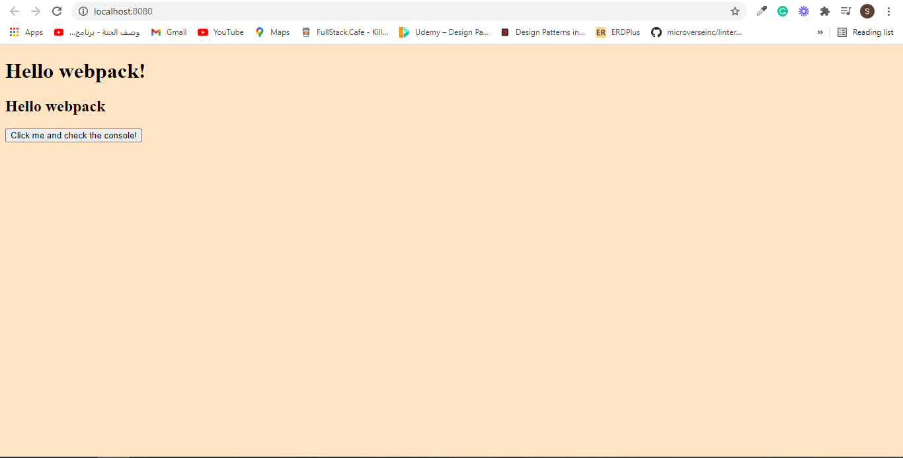

# Webpack Start Point

> Poject for starting any project with webpack.

## Built With

- NPM
- HTML & CSS
- JavaScript

## Getting Started

To get a local copy up and running follow these simple example steps.

- git clone [git@github.com:ShahierNashaat/awesome-books.git](https://github.com/ShahierNashaat/webpack-start-point.git)
- cd into awesome-books file
- Open with Browser or one of the note editor to edit.

## Authors

👤 **Shahier Nashaat**

- GitHub: [@githubhandle](https://github.com/ShahierNashaat)
- Twitter: [@twitterhandle](https://twitter.com/ShahierN)
- LinkedIn: [LinkedIn](https://www.linkedin.com/in/shahier-nashaat-73519313a/)

## 🤝 Contributing

Contributions, issues, and feature requests are welcome!

Feel free to check the [issues page](../../issues/).

## Show your support

Give a ⭐️ if you like this project!

## Acknowledgments

- Hat tip to anyone whose code was used
- Inspiration
- etc

## 📝 License

This project is [MIT](./MIT.md) licensed.
